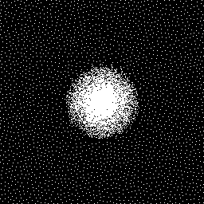

# 2D-PUPO
This is an implementation of paper "S. Xue and R. Bai. 2D Probabilistic Undersampling Pattern Optimization for MR Image Reconstruction. *IEEE Transactions on Medical Imaging*, 2020, under review."



# Environment
- OS: Ubuntu Linux kernel 4.15.0-76-generic x86_64
- CPU: Intel Xeon(R) Platinum 8163 CPU @ 2.50GHz x 96
- Memory: 503 GB
- GPU: NVIDIA Tesla V100 (32 GB) x 4

# Software
- Python 2.7.15
- Tensorflow 1.13.1
- Keras 2.2.4
- CUDA Toolkit 10.0.130
- CUDNN 7.6.5
- OpenCV 2.4.11
- Numpy 1.16.5


# Dataset

- 3T MR images
- MICCAI images

# Train

```
python main.py --gpu=0 --run=train --dataset=MRI_3T --model=VDSR
```

# Parameters for training


# Test

```
python main.py --gpu=0 --run=validate --dataset=MRI_3T --model=VDSR
```

# Contact
Ph.D., **Shengke Xue**

College of Information Science and Electronic Engineering

Zhejiang University, Hangzhou, P.R. China

Email: xueshengke@zju.edu.cn, xueshengke93@gmail.com
